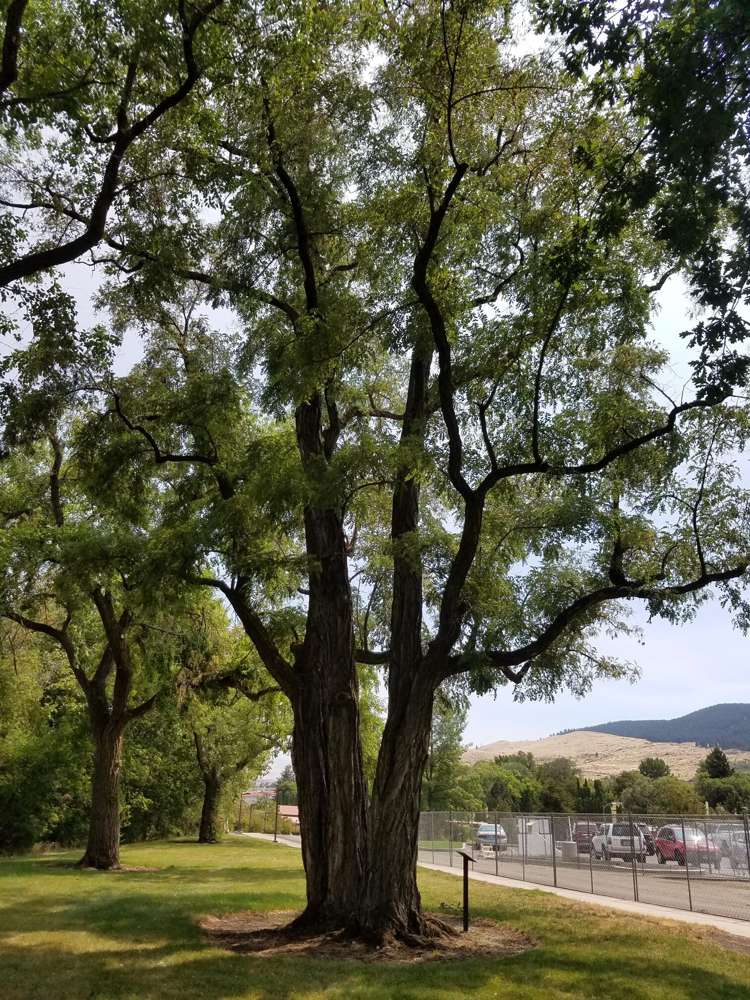
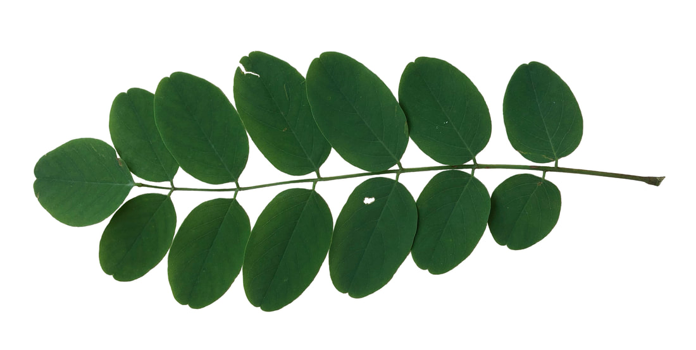
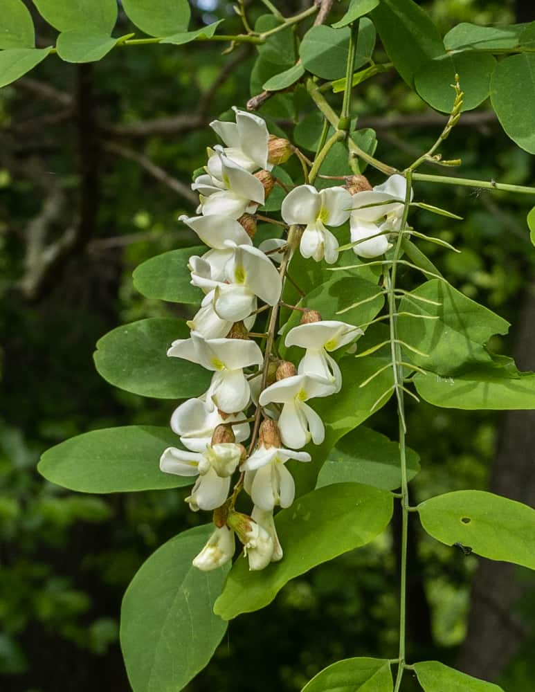
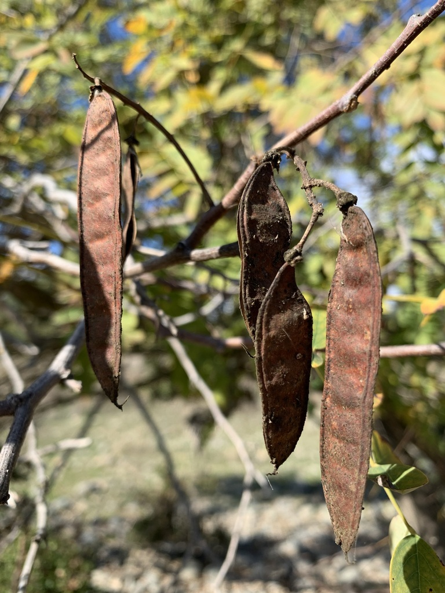

## Summary

#### Black locust (*Robinia pseudoacacia*) is a medium-sized deciduous tree native to the Appalachian and Ozark regions of the eastern United States. The species grows quickly and is highly adaptable, allowing it to thrive in disturbed habitats such as roadsides, abandoned fields, forest edges, and reclaimed mining sites. Black locust is well known for its ability to fix atmospheric nitrogen through a symbiotic relationship with soil bacteria, which allows it to grow in poor or degraded soils and gradually improve soil fertility. Because of this trait and its rapid growth, the species has been widely planted for erosion control, land reclamation, and timber production. However, outside of its native range black locust can spread aggressively through root suckers and dense seed production, sometimes forming monocultures that reduce native plant diversity.

## Identifying Features

* The **leaves** of the black locust are alternate and pinnately compound, meaning multiple leaflets are arranged in two rows along a central stem (the rachis). Leaflets come in 3-8 pairs plus a terminal leaflet. Leaflets are oval or elliptical, and typically 2-5 centimeters long. A pair of short, sharp thorns sit at the base of each leaf where it attaches to the twig. 

{height="300px"}

* **Flowers** come in axillary clusters (groups of blossoms emerging from the axil, upper angle between leaf stalk and the stem), that are 10 to 20 centimeters in length. The white flowers are fragrant and typically 2 to 2.5 centimeters long. 

{height="300px"}

* The **fruits** are flat and smooth legume seed pods, 2 to 4 inches in length and contain 4 to 8 seeds. The pods turn brown upon maturity in late summer/early fall and persist through winter. The seeds rarely germinate.

{height="300px"}

## Ecological Services

#### Black locust provides several ecological benefits, particularly in disturbed or nutrient-poor environments. As a nitrogen-fixing species, it enriches soil by converting atmospheric nitrogen into forms usable by plants, improving soil fertility and facilitating ecological succession. This ability makes black locust an important pioneer species that helps stabilize degraded landscapes and prepare sites for later successional plant communities. The tree’s deep root system also stabilizes soil and reduces erosion on slopes or disturbed ground. Its abundant spring flowers are an important nectar source for pollinators, and the tree contributes organic matter to the forest floor through leaf litter, improving soil structure and nutrient cycling.

### Animal Uses and Relationships

-   Black locust flowers produce abundant nectar that supports pollinators such as honeybees, native bees, and butterflies
-   Honeybees use the nectar to produce acacia honey, a light-colored honey known for its mild flavor
-   The seeds and foliage are occasionally consumed by birds and small mammals
-   White-tailed deer browse on young shoots and foliage
-   The tree serves as a host plant for several insects, including moth caterpillars and leaf-feeding beetles
-   Older trees may develop cavities that provide nesting sites for birds and shelter for small mammals

## Fun Facts
*

-   Black locust wood is extremely dense and rot-resistant, making it one of the most durable hardwoods in North America
-   The wood is commonly used for fence posts and outdoor structures because it resists decay without chemical treatment
-   The fragrant white flowers appear in hanging clusters in late spring and are a major nectar source for honey production
-   Although the flowers are edible when cooked, most other parts of the tree (especially bark and seeds) are toxic to humans and livestock
-   Early American settlers widely planted black locust for erosion control and durable timber

## Indigenous History/Uses
*

-   Indigenous peoples in eastern North America used black locust wood to craft bows, tools, and structural supports due to its strength and durability
-   The rot-resistant wood was valued for stakes, agricultural implements, and construction materials
-   Some Indigenous groups used parts of the plant medicinally, including preparations from the bark or leaves for minor ailments
-   The tree’s durable wood and rapid growth made it an important natural resource for tools and land management

## Conservation

#### Black locust is not currently considered threatened and is widely distributed across North America. In many regions outside of its native range the species behaves as an aggressive colonizer because it spreads through both seeds and root suckers. Dense stands can form that outcompete native vegetation and alter soil chemistry through nitrogen enrichment. For this reason, black locust management often focuses on controlling its spread in sensitive ecosystems such as prairies, grasslands, and certain forest habitats. At the same time, the species remains valuable in restoration settings where soil stabilization, nitrogen enrichment, and rapid vegetation establishment are needed.

### References

U.S. Department of Agriculture, Natural Resources Conservation Service. (2023). Black locust (*Robinia pseudoacacia*) plant guide. https://plants.usda.gov/DocumentLibrary/plantguide/pdf/pg_ROPS.pdf

Huntley, J. C. (1990). Robinia pseudoacacia L. black locust. In R. M. Burns & B. H. Honkala (Eds.), Silvics of North America: Vol. 2. Hardwoods. U.S. Forest Service. https://dendro.cnre.vt.edu/dendrology/USDAFSSilvics/40.pdf

North Carolina State University Extension. (2024). Robinia pseudoacacia (black locust). https://plants.ces.ncsu.edu/plants/robinia-pseudoacacia/

Wisconsin Department of Natural Resources. (2024). Black locust (Robinia pseudoacacia). https://dnr.wisconsin.gov/topic/Invasives/fact/BlackLocust